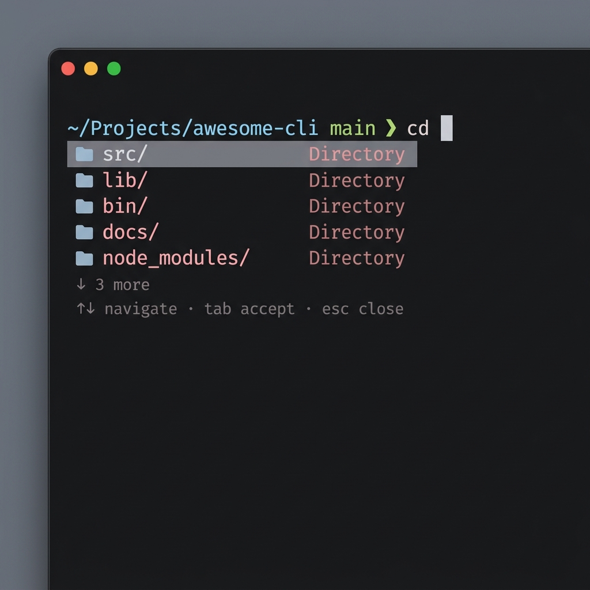

<div align="center">
  <h1>OmniComplete</h1>
  <p><strong>A blazingly fast, modern autocomplete UI for your terminal</strong></p>
  
</div>

OmniComplete is a native autocomplete system for your shell. It brings the rich, visual, IDE-like autocomplete dropdowns (similar to Fig or Warp) to your terminal, but entirely native to Zsh. It operates as a lightweight background daemon and renders UI directly onto your terminal's screen without requiring you to switch terminal emulators or use bulky wrappers.

## ✨ Features

- **Native Zsh Integration**: Operates purely using Zsh's `POSTDISPLAY` and `region_highlight` — zero input lag and no wrappers.
- **Deep Docker Compose Intelligence**: Parses your `docker-compose.yml` locally to provide context-aware suggestions for services, volumes, networks, profiles, and environment variables. Includes live container health status (🟢/🔴).
- **Smart Exec Suggestions**: When running `docker compose exec [service]`, OmniComplete inspects the service's underlying image and suggests relevant tools (e.g., suggesting `psql` for a Postgres image, or `redis-cli` for Redis).
- **Fuzzy Matching**: Type `T/m/a` to instantly match `project/my_project/api/`.
- **Rich Visual Dropdowns**: Displays files, folders, commands, and arguments with distinct icons and ANSI colors.
- **Customizable Themes**: Choose between an `inline` look or a floating `popover` style.
- **Zero Config Required**: Works out of the box with built-in specs for `git`, `docker`, `docker compose`, `npm`, `kubectl`, and file system navigation.
- **TUI Settings**: Built-in terminal UI for visually managing all your settings.

## 🚀 Installation

### Option 1: Using NPM (Recommended)
Because OmniComplete is extremely fast and lightweight, installing globally via NPM is the best experience across all operating systems.
```bash
npm install -g @lirimkrosa/omnicomplete
```

### Option 2: Using Homebrew (macOS)
If you prefer Homebrew, you can tap and install directly:
```bash
brew tap lirimkrosa/omnicomplete
brew install omnicomplete
```

### 3. Install the shell integration
Simply run the built-in integrations command to automatically configure your shell (Zsh, Bash, or Fish):
```bash
omni integrations install autocomplete
```

### 4. Reload your shell
```bash
source ~/.zshrc
```

## 🛠️ Usage

OmniComplete starts working automatically as you type. 
For example, typing `cd ` or `git ` will instantly bring up the autocomplete dropdown.

### Keyboard Shortcuts

- `↑` / `↓` or `Tab` / `Shift+Tab`: Navigate through the suggestion list.
- `Enter`: Accept the currently highlighted suggestion.
- `Esc`: Close the autocomplete menu.

### Settings UI

OmniComplete comes with a beautiful Terminal UI (TUI) to configure your preferences without manually editing configuration files.

Run the following command anywhere in your terminal:
```bash
omni settings
```

This will open the settings menu where you can customize:
- **Layout Theme**: `inline` or `popover`
- **Max Suggestions**: How many items to show in the dropdown
- **Fuzzy Matching**: Toggle intelligent fuzzy search
- **Colors & Delays**: Fine-tune the look and feel

### Daemon Management

The autocomplete engine runs as a lightweight background daemon.

- `omni daemon status`: Check if the daemon is running.
- `omni daemon stop`: Kill the background daemon. (It will restart automatically on your next keystroke).

## 🧠 Adding Custom Specs

You can easily extend OmniComplete to understand your own scripts, CLIs, or internal tools by adding custom spec JSON files. 

By default, the daemon loads custom specifications from `~/.cli-autocomplete/specs/`. Just drop a `.json` file in there, and the daemon will instantly pick it up.

**Example `myscript.json`**:
```json
{
  "name": "myscript",
  "description": "My custom internal tool",
  "subcommands": [
    {
      "name": "deploy",
      "description": "Deploy to production",
      "options": [
        {
          "name": ["--force", "-f"],
          "description": "Force the deployment"
        }
      ]
    }
  ]
}
```

## 🏗️ Architecture

OmniComplete is broken down into three core components:

1. **The Daemon (`daemon.js`)**: A Node.js background process that holds the autocomplete engine, loads command specifications, handles fuzzy search, and generates the ANSI output string.
2. **The Shell Integration (`integration.js`)**: A shell script that listens to ZLE (Zsh Line Editor) keystroke events via an asynchronous socket and pulls state from the daemon.
3. **The Zsh Parser (`zsh-highlight.js`)**: A specialized JavaScript parser that seamlessly translates complex ANSI 256 color codes into Zsh's `region_highlight` strings, allowing the daemon to paint a full UI natively inside the terminal.

## 📄 License

MIT License. See [LICENSE](LICENSE) for more information.
